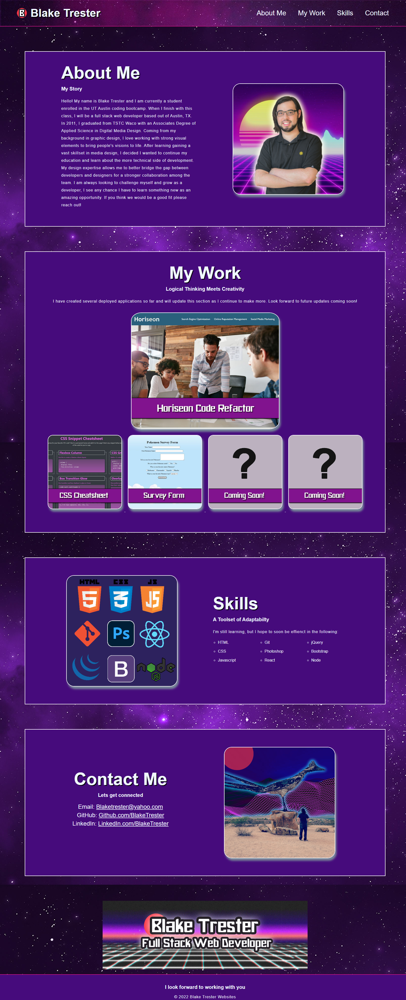

# Personal Portfolio

## Blake Trester 

**Goal:**

My primary goal for this project was to create a personal portfolio for myself while practicing everything that I have learned up until this point. During this project I was able to identify areas that I needed to practice more as well as learned my strengths in creating responsive and appealing websites. This project is benificial not only for gaining more experience and practice, but it will also double as something I can continue to update and use to help grow my professional career. Having a strong portfolio will help me stand out to industry professionals and potential future employers.

**Building a Responsive Website**
- I was tasked with building a personal website from scratch. I started by building a solid foundation for the website in HTML, including good use of semantic html and adding comments to help better organize the index file. I added functional links to my navigation bar that will direct the viewer to different sections throughout the website. Using my background in graphic design, I created images that I felt would be a good fit for my page and inserted them into their appropriate locations within the page. I made sure all images included and alt text tag to help with accessability. 

- I used CSS to start styling the website with many different design elements that would help my portfolio page become more visually appealing while still remaining fully functional. I changed the font and sizes of the text and added background color to make everything stand out more to anyone who views the page. I also added runded borders and drop shadows to the images so they would look more dynamic. I included hover effects to all of the links so they would be more impressionable before someone clicks them.

- I made sure the entire website had good responsive design so that it will look good on any size screen across multiple types of devices. I made sure to clean up and condense my code so it would be easier to read I want to work on this project again. Throughout the time I spent working on this project, I made sure to consistantly update my repository and included informative commit messages to help when updating in the future.

## Demo
View the website at the link below:

https://blaketrester.github.io/Blake_Trester_Portfolio/

## Credits

All images were created and edited by Blake Trester

## License

MIT License

Copyright (c) 2022 Blake Trester

Permission is hereby granted, free of charge, to any person obtaining a copy
of this software and associated documentation files (the "Software"), to deal
in the Software without restriction, including without limitation the rights
to use, copy, modify, merge, publish, distribute, sublicense, and/or sell
copies of the Software, and to permit persons to whom the Software is
furnished to do so, subject to the following conditions:

The above copyright notice and this permission notice shall be included in all
copies or substantial portions of the Software.

THE SOFTWARE IS PROVIDED "AS IS", WITHOUT WARRANTY OF ANY KIND, EXPRESS OR
IMPLIED, INCLUDING BUT NOT LIMITED TO THE WARRANTIES OF MERCHANTABILITY,
FITNESS FOR A PARTICULAR PURPOSE AND NONINFRINGEMENT. IN NO EVENT SHALL THE
AUTHORS OR COPYRIGHT HOLDERS BE LIABLE FOR ANY CLAIM, DAMAGES OR OTHER
LIABILITY, WHETHER IN AN ACTION OF CONTRACT, TORT OR OTHERWISE, ARISING FROM,
OUT OF OR IN CONNECTION WITH THE SOFTWARE OR THE USE OR OTHER DEALINGS IN THE
SOFTWARE.
